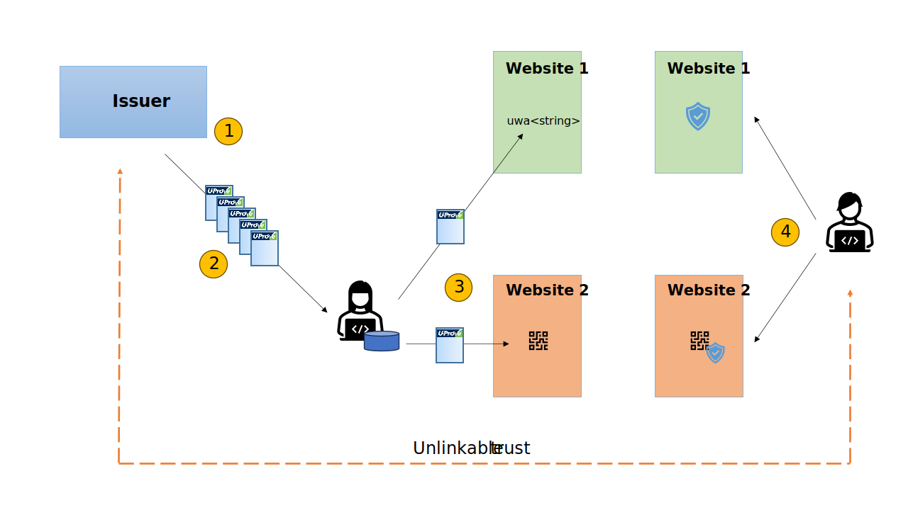

*** ***PRE-RELEASE VERSION: WORK IN PROGRESS*** ***

# User-centric Web Attestations

This project is a proof-of-concept prototype for User-Centric Web Attestations (UWA). These attestations are statements (encoded as U-Prove tokens) certified by an Issuer that can be attached to a web site by their User and verified by anyone. The UWA are only valid on the page (scope) to which they are attached. UWA protects the privacy of users; they contain no traceable information other than the application-specific data a user might want to disclose. Users are in control of which attestations to present where.

Details can be found in the [UWA specification](./doc/uwa-spec.md).

The repository contains two projects, which need to be setup separately:
* an Express [sample server](./sample-issuer/README.md)
* a Edge/Chrome [web browser extension](./browser-extension/README.md)

## System overview

The system consists of three participants:
* an Issuer that issues U-Prove tokens to Users
* a User that obtains U-Prove tokens from Issuers, and creates web attestations
* a Verifier that verifies web attestations

The [sample server](./sample-issuer/README.md) implements the Issuer role, while the [web browser extension](./browser-extension/README.md) implements both the User and Verifier roles.

The UWA lifecycle is as follows:
1. The Issuer sets up its Issuer parameters and publishes them in a publicly accessible location. These specify the contents of the U-Prove tokens, which can contain an application-specific label. Users and Verifiers must obtain the Issuer parameters before creating or verifying web attestations.
2. The User obtains U-Prove tokens from an Issuer. Authentication to the Issuer is application-specific. U-Prove tokens are stored in the web browser extension; new tokens will be automatically obtained if they expired or if they are running out.
3. When visiting a web site, the User can create a web attestation using the web browser extension (encoded either as a string or a QR code), and attach it to the site.
4. Other users visiting the same web site can validate attached web attestations from trusted Issuers using the web browser extension. Unknown Issuers can be added to the trusted list by the User. Invalid attestations (for example: forged, or copied to a different site) are marked as such; malformed ones are simply ignored.

## Contributing

This project welcomes contributions and suggestions.  Most contributions require you to agree to a
Contributor License Agreement (CLA) declaring that you have the right to, and actually do, grant us
the rights to use your contribution. For details, visit https://cla.opensource.microsoft.com.

When you submit a pull request, a CLA bot will automatically determine whether you need to provide
a CLA and decorate the PR appropriately (e.g., status check, comment). Simply follow the instructions
provided by the bot. You will only need to do this once across all repos using our CLA.

This project has adopted the [Microsoft Open Source Code of Conduct](https://opensource.microsoft.com/codeofconduct/).
For more information see the [Code of Conduct FAQ](https://opensource.microsoft.com/codeofconduct/faq/) or
contact [opencode@microsoft.com](mailto:opencode@microsoft.com) with any additional questions or comments.

## Trademarks

This project may contain trademarks or logos for projects, products, or services. Authorized use of Microsoft 
trademarks or logos is subject to and must follow 
[Microsoft's Trademark & Brand Guidelines](https://www.microsoft.com/en-us/legal/intellectualproperty/trademarks/usage/general).
Use of Microsoft trademarks or logos in modified versions of this project must not cause confusion or imply Microsoft sponsorship.
Any use of third-party trademarks or logos are subject to those third-party's policies.
